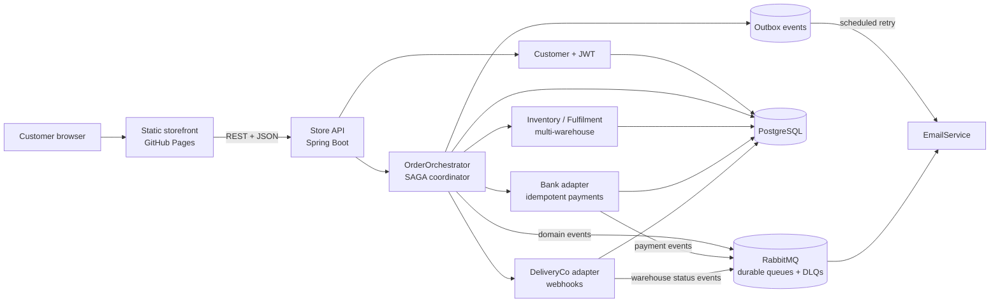
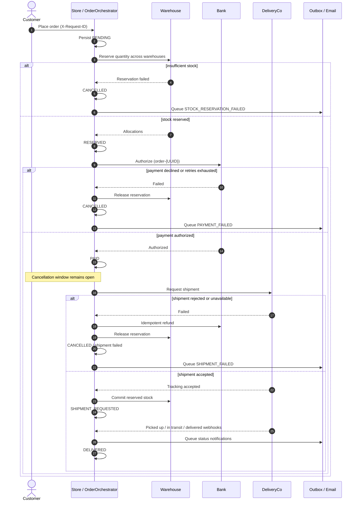

# Haven - Resilient E-Commerce Order System

[](https://dkon109.github.io/Enterprise-Scale-Online-Store-System/)
[](https://github.com/DKon109/Enterprise-Scale-Online-Store-System)
[](build.gradle)
[](build.gradle)
[](https://github.com/DKon109/Enterprise-Scale-Online-Store-System/actions/workflows/ci.yml)
[](#test-evidence)

Haven is a portfolio-ready implementation of a distributed online-store workflow. It coordinates stock across multiple warehouses, idempotent payment processing, delivery hand-off, compensation, and reliable customer notification. The project was built for the University of Sydney's COMP5348 Enterprise-Scale Software Development group project.

The engineering focus is not the catalogue UI alone. It is keeping an order consistent when inventory, payment, delivery, messaging, or email partially fails.

## Try it in 60 seconds

1. Open the [instant storefront](https://dkon109.github.io/Enterprise-Scale-Online-Store-System/). The catalogue and product images load from GitHub Pages without a server cold start.
2. Wait for the status strip to change from **live demo is waking** to **Live ordering connected**. The free Render API may take up to 60 seconds to wake.
3. Select a product and sign in with `customer` / `COMP5348`.
4. Choose a quantity and place a demo order. No real payment is taken.
5. Open **Orders** to inspect the state and try cancellation while the order is still eligible.

> The public portfolio deployment uses an in-memory H2 database and disables RabbitMQ/outbox workers so it can run within a free hosting tier. The full PostgreSQL + RabbitMQ architecture is available through the [Docker setup](#run-the-full-distributed-stack). This distinction is intentional and documented rather than hidden.

## What this demonstrates

- An orchestrated SAGA with explicit order states and compensating actions.
- Atomic multi-warehouse reservation, release, and final stock deduction.
- Two-layer idempotency for client order retries and Bank purchase/refund requests.
- RabbitMQ durable queues, JSON events, listener retry, and dead-letter queues.
- Retry, circuit breaking, correlation IDs, and latency/outcome logging for inter-service calls.
- A transactional outbox for notification delivery when EmailService is unavailable.
- JWT authentication with BCrypt password storage.
- A responsive storefront separated from the cold-starting API.

## System architecture

The repository is a modular Spring Boot application whose domain boundaries model Store, Warehouse, Bank, DeliveryCo, and EmailService. Ports and adapters keep the order workflow independent of the concrete HTTP, persistence, and messaging integrations.



### Components and responsibilities

| Component | Responsibility | Implementation evidence |
|---|---|---|
| Store API | Authentication, product catalogue, order commands, order status | [`CustomerController`](src/main/java/com/comp5348/store/customer/controller/CustomerController.java), [`OrderController`](src/main/java/com/comp5348/store/order/controller/OrderController.java), [`ProductController`](src/main/java/com/comp5348/store/product/controller/ProductController.java) |
| Order coordinator | Enforces state transitions, retries calls, opens the payment circuit breaker, and runs compensation | [`OrderOrchestrator`](src/main/java/com/comp5348/store/order/application/service/OrderOrchestrator.java) |
| Warehouse / Inventory | Allocates one order across one or more warehouses; reserves, releases, and commits stock transactionally | [`InventoryService`](src/main/java/com/comp5348/store/inventory/service/InventoryService.java), [`Inventory`](src/main/java/com/comp5348/store/inventory/model/Inventory.java) |
| Bank | Creates idempotent purchase/refund transactions and publishes payment events | [`PaymentTransactionService`](src/main/java/com/comp5348/bank/service/PaymentTransactionService.java), [`PaymentTransaction`](src/main/java/com/comp5348/bank/model/PaymentTransaction.java) |
| DeliveryCo | Creates deliveries, accepts status webhooks, and simulates delayed progression and a 5% in-transit loss rate | [`DeliveryService`](src/main/java/com/comp5348/delivery/service/DeliveryService.java), [`DeliveryWebhookController`](src/main/java/com/comp5348/delivery/controller/DeliveryWebhookController.java) |
| Email / Outbox | Stores notification intent in the same database boundary and retries downstream delivery asynchronously | [`OutboxNotificationServiceAdapter`](src/main/java/com/comp5348/store/order/infrastructure/adapter/notification/OutboxNotificationServiceAdapter.java), [`OutboxWorker`](src/main/java/com/comp5348/store/order/infrastructure/outbox/OutboxWorker.java) |
| RabbitMQ integration | Separates Bank, Warehouse, and Email event consumers with durable queues and DLQs | [`RabbitMQConfig`](src/main/java/com/comp5348/messaging/config/RabbitMQConfig.java), [`messaging`](src/main/java/com/comp5348/messaging) |
| Persistence | JPA repositories, PostgreSQL production profile, H2 test/demo profile, optimistic versioning | [`application.properties`](src/main/resources/application.properties), [`Inventory`](src/main/java/com/comp5348/store/inventory/model/Inventory.java) |

## Order SAGA

The order is the aggregate that records progress. Each remote step is a small local transaction; failures invoke explicit compensation instead of attempting a distributed ACID transaction.



### State and compensation matrix

| Failure point | State before failure | Compensation | Final outcome |
|---|---|---|---|
| Stock unavailable | `PENDING` | In-memory partial allocation is rolled back; no payment call is made | `CANCELLED`, failure notification queued |
| Payment declined / unavailable | `RESERVED` | Release every warehouse allocation | `CANCELLED`, payment failure notification queued |
| Customer cancels before shipment | `PENDING`, `RESERVED`, or `PAID` | Refund if paid; release reserved stock | `CANCELLED` |
| Shipment rejected / exhausted retries | `PAID` | Idempotent refund, then stock release | Shipment failed/cancelled and customer notified |
| EmailService unavailable | Any notification-producing state | Keep the notification in `outbox_events`; retry up to the configured maximum | Eventually `SENT`, or `FAILED` for inspection |

The central flow and compensation methods are visible in [`OrderOrchestrator`](src/main/java/com/comp5348/store/order/application/service/OrderOrchestrator.java). State transition tests are in [`OrderOrchestratorE2ETest`](src/test/java/com/comp5348/store/order/application/OrderOrchestratorE2ETest.java).

## Idempotency: where duplicate work is prevented

Idempotency is implemented at both the order boundary and payment boundary because retries can occur at either layer.

| Boundary | Key | Behaviour | Evidence |
|---|---|---|---|
| Place order | Client `X-Request-ID` | Returns the existing order instead of inserting another order | [`OrderController`](src/main/java/com/comp5348/store/order/controller/OrderController.java), [`OrderOrchestrator.placeOrder`](src/main/java/com/comp5348/store/order/application/service/OrderOrchestrator.java), unique `request_id` in [`Order`](src/main/java/com/comp5348/store/order/model/Order.java) |
| Authorize payment | `order-{orderId}` | Reuses an existing Bank transaction for a repeated authorization | [`IdempotencyKeyGenerator`](src/main/java/com/comp5348/store/order/application/util/IdempotencyKeyGenerator.java), [`PaymentTransactionService`](src/main/java/com/comp5348/bank/service/PaymentTransactionService.java) |
| Persist payment/refund | Unique `idempotency_key` | Database constraint is the final duplicate-write guard | [`PaymentTransaction`](src/main/java/com/comp5348/bank/model/PaymentTransaction.java), [`PaymentTransactionRepositoryTest`](src/test/java/com/comp5348/bank/repository/PaymentTransactionRepositoryTest.java) |

Correlation and idempotency are separate: `X-Correlation-ID` traces one workflow across components, while `X-Request-ID` determines whether a repeated command is the same logical request.

## Why RabbitMQ

RabbitMQ was selected for operations that do not require the caller to block on the consumer:

- **Failure isolation:** Bank, Warehouse, and Email consumers can be temporarily unavailable without sharing the caller's request thread.
- **Buffering and back-pressure:** durable queues retain work while consumers recover.
- **At-least-once processing:** retry is preferable to silently dropping a payment or notification event; idempotency absorbs duplicates.
- **Poison-message isolation:** `bank_queue`, `warehouse_queue`, and `email_queue` each have a dedicated dead-letter queue.
- **Operational visibility:** queue depth, retry, and DLQ state can be inspected in the RabbitMQ management UI.

The trade-off is eventual consistency and duplicate delivery. The code therefore combines RabbitMQ with idempotent handlers, correlation IDs, bounded retry, and compensation. REST remains appropriate for commands that need an immediate decision, such as stock reservation or payment authorization.

## Failure scenarios and recovery

| Scenario | Detection | Automatic response | Verification |
|---|---|---|---|
| Transient Warehouse/Delivery/Bank error | Adapter call throws or times out | Four total attempts using the configured backoff schedule; attempts and latency logged | [`RetryPolicy`](src/main/java/com/comp5348/store/order/application/policy/RetryPolicy.java), resilience cases in [`OrderOrchestratorE2ETest`](src/test/java/com/comp5348/store/order/application/OrderOrchestratorE2ETest.java) |
| Repeated Bank failure | Circuit-breaker threshold reached | Circuit opens, blocks cascading calls, later moves to half-open, and closes after success | [`CircuitBreaker`](src/main/java/com/comp5348/store/order/application/policy/CircuitBreaker.java) |
| Payment failure | Decline or retry exhaustion | Release stock, cancel order, queue customer notification | [`handlePaymentFailure`](src/main/java/com/comp5348/store/order/application/service/OrderOrchestrator.java) |
| Delivery request failure | Rejection or retry exhaustion | Refund, release stock, cancel/mark shipment failed, notify customer | [`handleShipmentFailure`](src/main/java/com/comp5348/store/order/application/service/OrderOrchestrator.java) |
| Package loss | Delivery simulation cancels approximately 5% in transit | Status is persisted and visible to the workflow | [`DeliveryService`](src/main/java/com/comp5348/delivery/service/DeliveryService.java) |
| Email outage | REST delivery from worker fails | Outbox retry count increments; after the configured limit the event is marked `FAILED` and logged | [`OutboxWorker`](src/main/java/com/comp5348/store/order/infrastructure/outbox/OutboxWorker.java), [`OutboxEvent`](src/main/java/com/comp5348/store/order/model/OutboxEvent.java) |
| Poison RabbitMQ message | Listener retries exhausted | Reject without requeue and route to the component DLQ | [`RabbitRetryConfig`](src/main/java/com/comp5348/messaging/config/RabbitRetryConfig.java), [`RabbitMQConfig`](src/main/java/com/comp5348/messaging/config/RabbitMQConfig.java) |
| Concurrent stock update | JPA version mismatch | Conflicting transaction fails rather than silently overwriting stock | `@Version` in [`Inventory`](src/main/java/com/comp5348/store/inventory/model/Inventory.java) |

### Honest limitation

Notification intent uses a database outbox, but Bank/Warehouse RabbitMQ publication is not currently part of the same database transaction as the order update. The publisher logs broker errors and allows order processing to continue. A production evolution would use the same transactional outbox approach for every domain event, then add broker confirms and automated DLQ replay. The current implementation demonstrates the pattern for notifications without claiming exactly-once messaging.

## Test evidence

Latest verification on **24 July 2026** (also run on every push by [GitHub Actions CI](https://github.com/DKon109/Enterprise-Scale-Online-Store-System/actions/workflows/ci.yml)):

```text
./gradlew test bootJar --no-daemon

175 tests completed
0 failures
0 errors
0 skipped
BUILD SUCCESSFUL
```

The suite spans 22 test classes and includes:

- 37 order-orchestration tests (across `OrderOrchestratorE2ETest`, `OrderServiceTest`, `OrderServiceIntegrationTest`): happy path, stock/payment/shipment failures, multi-warehouse allocation, cancellation, idempotency, correlation, outbox, retry, and circuit breaking.
- Controller integration tests for Bank, Delivery, Fulfilment, and Order endpoints.
- Repository constraint tests, including duplicate payment idempotency keys.
- Customer, JWT, inventory, domain model, and messaging producer/listener tests.

Start with [`OrderOrchestratorE2ETest`](src/test/java/com/comp5348/store/order/application/OrderOrchestratorE2ETest.java), then browse the complete [`src/test`](src/test) tree. API walkthrough collections are also provided in [`COMP5348_Order_Processing_Steps.json`](COMP5348_Order_Processing_Steps.json) and [`COMP5348_Order_Cancellation_Tests.json`](COMP5348_Order_Cancellation_Tests.json).

## My contribution

This was a four-person university project. The table below separates my work from the overall team system using the repository history for `Ryoji Kondo / George <rkon0071@uni.sydney.edu.au>`.

| Area I owned or materially implemented | Evidence in history |
|---|---|
| Warehouse and inventory domain, repositories, services, and REST controllers | `d835bf7`, `09c5d5f`, `aac6213` |
| Multi-warehouse reserve/release/commit behaviour and optimistic inventory versioning | `09c5d5f`, `aac6213` |
| Product catalogue module | `84bdae7` |
| Delivery/Fulfilment integration and 5% delivery-loss simulation | `aac6213`, `369b072` |
| Portfolio storefront, demo data/profile, deployment health endpoint, and Render packaging | `583b5da` |
| Product photography and storefront presentation | `dda88ef` |
| Cold-start mitigation: instant GitHub Pages frontend, static fallback catalogue, API wake status, and cross-origin API integration | `b3335ab` |

Other team members contributed the customer/JWT module, order domain and orchestration, Bank/payment module, messaging, tests, and report integration. See the full [`commit history`](https://github.com/DKon109/Enterprise-Scale-Online-Store-System/commits/codex/frontend-production/) for attribution.

## Run the full distributed stack

### Prerequisites

- Docker Desktop with Docker Compose
- Ports `8081`, `5432`, `5672`, and `15672` available

### Start

```bash
git clone https://github.com/DKon109/Enterprise-Scale-Online-Store-System.git
cd Enterprise-Scale-Online-Store-System
git switch codex/frontend-production
docker compose up --build
```

Open:

- Storefront/API: <http://localhost:8081>
- RabbitMQ management: <http://localhost:15672> (`guest` / `guest`)
- PostgreSQL: `localhost:5432`, database `onlinestore`

Demo customer: `customer` / `COMP5348`.

Stop the stack with `docker compose down`. Add `-v` only if you intentionally want to delete the local PostgreSQL and RabbitMQ volumes.

### Run tests without Docker

```bash
./gradlew test
./gradlew bootJar
```

Tests use isolated test configuration and do not require the running Docker stack.

## Demo script for an interview

| Time | Action | Engineering point to explain |
|---:|---|---|
| 0:00 | Open the instant storefront and search the catalogue | Static frontend remains available even while the free API wakes |
| 0:15 | Sign in and place an order | JWT authentication and client request idempotency |
| 0:30 | Show stock changing across the order | Multi-warehouse reservation and commit semantics |
| 0:45 | Open the order state | SAGA state transitions and correlation ID |
| 1:00 | Cancel an eligible order | Compensation: refund plus stock release |
| 1:15 | Open the SAGA diagram in this README | Failure handling is explicit and test-backed |
| 1:30 | Point to the test result and contribution table | Verification and individual ownership are immediately auditable |

For a failure demonstration in the full stack, stop RabbitMQ or configure a payment/shipment adapter failure, run the relevant order step, then show retry/log output, the final compensated order state, restored inventory, and any DLQ/outbox record.

## Design decisions and trade-offs

- **SAGA over distributed two-phase commit:** improves availability and permits independent recovery, at the cost of more states and compensation logic.
- **Optimistic locking over pessimistic locks:** matches relatively low contention while rejecting lost updates, but callers must handle version conflicts.
- **RabbitMQ plus REST:** asynchronous events isolate non-blocking consumers; synchronous REST preserves immediate command outcomes. Supporting both increases operational complexity.
- **Outbox over inline email:** order transactions do not depend on EmailService uptime, at the cost of delayed delivery and worker operations.
- **Modular monolith for the assignment:** domain boundaries and ports/adapters are visible without the deployment overhead of five independently operated services. Modules can be extracted later, but this repository should not be mistaken for a fully independently deployed microservice fleet.
- **Static portfolio frontend plus sleeping free API:** first paint is immediate and free; transactional actions may briefly wait for the API to wake.

## Technology

Java 17, Spring Boot 3.3, Spring Security, JWT, Spring Data JPA/Hibernate, PostgreSQL, H2, RabbitMQ/AMQP, Gradle, JUnit 5, Mockito, Docker Compose, GitHub Actions, GitHub Pages, and Render.

## Project context

The implementation follows the supplied COMP5348 brief: authenticate the demo customer, allocate physical stock across warehouses, transfer funds through Bank, request DeliveryCo pickup, send customer notifications, permit cancellation before shipment, and recover from at least two partial-failure scenarios. The accompanying final report documents the original architectural rationale, ERD, and sequence diagram; this README updates that material into an implementation-linked portfolio view.

